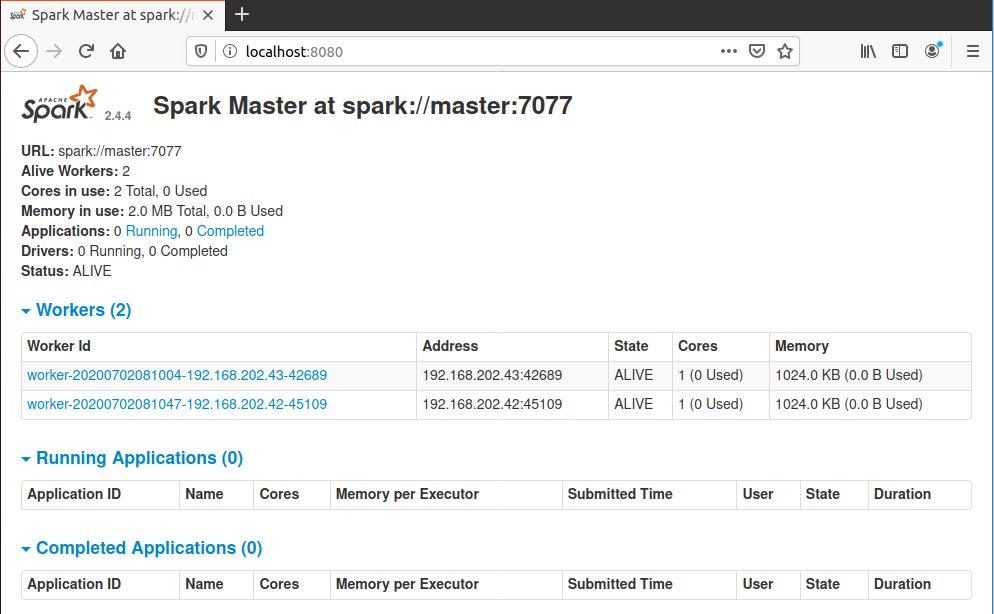
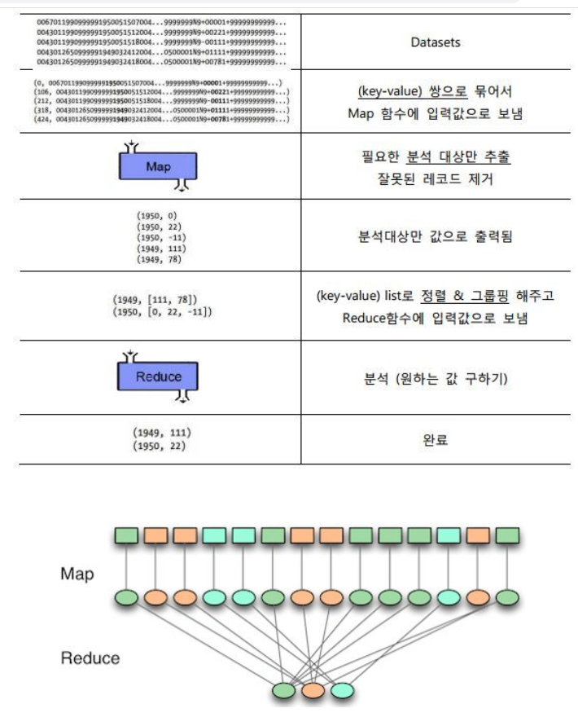
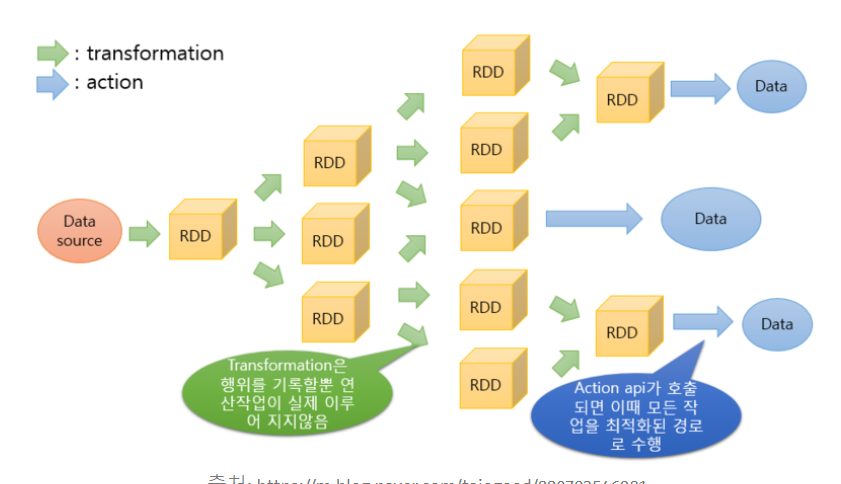

# SPARK Install & Cluster 구성

## 목차

### Spark 

1. JAVA 설치
2. Spark 다운로드 및 설치
3. Spark란 폴더 이름으로 library에 저장
4. 실행 Path 저장
5. spark 실행

### spark cluster

1. vitualbox 네트워크 어뎁터 설정(브릿지 사용)
2. master가 관리 할 worker등록
3. cluster ssh연결
4. Spark Cluster의 구축
5. Worker의 인스턴스 환경 설정
6. Start Worker
7. log4j:WARN Please initialize the log4j system properly 오류
8. cannot run program "python": error=2, No such file or directory 오류
9. ModuleNotFoundError - No Module named _ctypes 오류

## Spark Install

### java 설치

- spark에는 자바가 필요하므로 자바를 설치 한다.
- 자바가 이미 설치돼 있다면 생략한다.

```bash
$ sudo apt-get install default-jdk
```

##### JAVA 환경변수 지정

환경변수를 지정하기 위해, Path를 알아야 합니다.
JAVA관리를 위한 명령어를 통하면, 각 JAVA들의 path를 확인할 수 있습니다.
예를 들어, /usr/lib/jvm/java-8-openjdk-amd64 라는 Path를 확인하여, environment 에 아래와 같이 추가해줍니다.

$ sudo nano /etc/environment

> JAVA_HOME="/usr/lib/jvm/java-8-openjdk-amd64"

저장을 하고 나서, 아래 명령어로 적용을 해주면 됩니다.

$ source /etc/environment

PATH가 제대로 지정되었는지 확인하기 위해서는 아래 명령을 사용합니다.

$ echo $JAVA_HOME

### spark 다운로드 및  설치

- spark-2.4.4-bin-hadoop 2.7.tgz을 설치하도록 한다.

```bash
$ wget https://archive.apache.org/dist/spark/spark-2.4.4/spark-2.4.4-bin-hadoop2.7.tgz
$ sudo tar -xzvf spark-2.4.4-bin-hadoop 2.7.tgz
```


### spark란 폴더 이름으로 library에 저장

```bash
# spark란 폴더이름으로 현재 경로에 저장
$ mv spark-2.2.0-bin-hadoop2.7/ spark 

# spark란 폴더이름을 /usr/lib에 이동
$ sudo mv spark/ /usr/lib/
```


### 실행 Path 저장

- bashrc 실행

```
# open the bashrc 
$ sudo vim ~/.bashrc or $ vi ~/.bashrc
```

- JAVA_HOME구하기

  참고 :(https://all-record.tistory.com/181) (ubuntu 자바 설정)

```bash
#위치 확인
$ which javac
/usr/bin/javac

#javac의 실제 위치
$ readlink -f /usr/bin/javac
/usr/lib/jvm/java-11-openjdk-amd64/bin/javac
```

- PATH에 spark를 먼저 등록해주자(일회성)(알아두자)

```bash
$ export PATH=$PATH:/usr/lib/spark/bin
```

- 아래의 Path 정보를 bashrc에 입력

```bash
export JAVA_HOME=/usr/lib/jvm/java-11-openjdk-amd64
export SPARK_HOME=/usr/lib/spark
export PATH=$SPARK_HOME/bin:$PATH

#재부팅 안하고 bashrc 재시작
# cd /usr/lib/spark/bin에 들어가서 해주니 다했는데 안됐을때 됐다.
source ~/.bashrc
```

- default-java란 이름으로 java가 설치했으나  java-11-openjdk-amd64를 설치하였으므로 맨윗줄에 적었다.
- 이 외에 설치 했었다면 설치한 버전으로 바꿔줘야 한다.
- 설치된 spark의 Path정보도 입력후 $PATH에 append한다.

### spark 실행

-  **./spark-shell**을 실행해준다.

```bash
$ ./spark-shell
```

- 아래의 내용이 나오면 설치가 잘 된것이다.

```bash
$ spark-shell
Spark session available as 'spark'.
Welcome to
      ____              __
     / __/__  ___ _____/ /__
    _\ \/ _ \/ _ `/ __/  '_/
   /___/ .__/\_,_/_/ /_/\_\   version 2.4.4
      /_/

Using Scala version 2.11.12 (OpenJDK 64-Bit Server VM, Java 11.0.7)
Type in expressions to have them evaluated.
Type :help for more information.

scala> 
```


## Cluster 구성

### vitualbox 네트워크 어뎁터 설정

> master, worker 둘다 네트워크 => 어댑터1 => 어뎁터에 브리지
>
> 각각의 ip를 설정해줌

### master가 관리 할 worker등록

- master에 vim /etc/hosts에 worker1, worker2 등록해준다

```bash

192.168.202.36          localhost
192.168.202.36          master
192.168.202.42          worker1
192.168.202.43          worker2

# The following lines are desirable for IPv6 capable hosts
::1     ip6-localhost ip6-loopback
fe00::0 ip6-localnet
ff00::0 ip6-mcastprefix
ff02::1 ip6-allnodes
ff02::2 ip6-allrouters
```

### cluster ssh연결

- rsa 암호화방식으로 키 생성을 해준다

- sudo 로 실행 해야 하기 때문에 sudo로 생성해준다

```bash
$ sudo ssh-keygen -t rsa
#엔터 3번 

#키생성 확인 
#root 로 넘어가서
$ ls -al ~/.ssh/
-rw------- 1 root root 2602  7월  2 09:49 id_rsa
-rw-r--r-- 1 root root  567  7월  2 09:49 id_rsa.pub
```

  ```bash
$ chmod 700 ~/.ssh
$ chmod 600 ~/.ssh/id_rsa
$ chmod 644 ~/.ssh/id_rsa.pub
$ chmod 644 ~/.ssh/authorized_keys

#authorized_keys가 존재 하지 않을시 id_rsa.pub를 copy해준다
# $ cp id_rsa.pub ~/.ssh/authorized_keys
  ```

### Spark Cluster의 구축

- Master 인스턴스를 띄운다.
- Worker 인스턴스를 붙여 준다.
- 이를 반복해준다.

```bash
#master
SPARK_HOME/sbin/star-master.sh
$ cd /usr/lib/spark/sbin/
$ ./start-master.sh
```

- http://localhost:8080/을 접속하면 Master와 클러스터에 대한 구성 정보가 나온다.
- spark는 기본적으로 7077 포트를 사용한다.

### Worker의 인스턴스 환경 설정

```bash
#worker
SPARK_HOME/conf
$ cd /usr/lib/spark/conf
$ cp stark-env.sh.template spark-env.sh

#vim spark-env.sh
export SPARK_WORKER_INSTANCES=3
```

- export SPARK_WORKER_INSTANCES=3을 입력해주면 한번 명령어를 치면 worker 3명이 가서 일을 시작한다.

### Start Worker

```bash
#worker
SPARK_HOME/sbin/start-slave.sh
$ cd /usr/lib/spark/sbin
$ ./start-slave.sh spark://hostname:7077 -m 256M -c 2
ex) $ ./start-slave.sh spark://192.168.202.36:7077 -m 256M -c 2
```

- m : 사용할 메모리의 갯수
- -c : 사용할 코어의 갯수
- 잘 진행 되었다면 Workers 항목에 워커가 등록된다.
- 

### Test  Spark

- 실행이 됬다면 잘 동작하는지 확인해보자.
- vim 으로 test파일을 작성하자

```python
from pyspark import SparkContext

logFile = "/usr/lib/spark/README.md"
sc = SparkContext("local", "Simple App")
logData = sc.textFile(logFile).cache()

numAs = logData.filter(lambda s: 'a' in s).count()
numBs = logData.filter(lambda s: 'b' in s).count()

print("Lines with a: %i, lines with b: %i" % (numAs, numBs))

```

```
$ cd /usr/lib/spark/
./spark-submit test.py
```

### log4j:WARN Please initialize the log4j system properly 오류

log4j는 자바에서 사용하는 로그를 기록하는 라이브러리입니다.

이 라이브러리를 이용해서 많은 프로그램들이 디버깅용 로그를 남긴다든지, 시스템에 중요한 정보를 남긴다는지를 합니다.

log4j는 현재 동작하는 자바환경에서

**log4j.properties** 혹은 **log4j.xml** 파일을 찾아서 해당하는 파일의 정보값을 읽어서 

이렇게 설정된 대로 로그를 남기게 됩니다.

이 파일들이 CLASSPATH에서 찾을 수 없으니 이러한 워닝이 발생했다.

[해결법]

아래의 코드를 /usr/lib/spark/conf의 log4j.properties.template을 복사해서 log4j.properties을 하나 만들고 아래의 코드를 붙여 넣자.

```bash
# Set root logger level to DEBUG and its only appender to A1.
log4j.rootLogger=DEBUG, A1
# A1 is set to be a ConsoleAppender.
log4j.appender.A1=org.apache.log4j.ConsoleAppender
# A1 uses PatternLayout.

log4j.appender.A1.layout=org.apache.log4j.PatternLayout
```

### cannot run program "python": error=2, No such file or directory 오류

환경변수의 값이 잘못 설정 되어 있다.

[해결법]

```
export PYSPARK_PYTHON=python3
or 
vim ~/.bashrc에서
export PYSPARK_PYTHON=python3 추가
```

### ModuleNotFoundError - No Module named _ctypes 오류

설치해주자

```
# 우분투
sudo apt install libffi-dev 
```

## spark session 객체 생성

### sparkSession은 모든 Spark작업의 시작점이다.

```python
#파이썬에서 SparkSession 생성하기
from pyspark.sql import SparkSession
import time

spark = SparkSession.builder.master("local").appName("Word Count").config("spark.some.config.option", "some-value").getOrCreate()

time.sleep(60)
```

### worker를 연결후 예제 실행

```
./spark-submit testSession.py
```

## Spark에서 사용하는 Data Structure

- **RDD**
- **Dataset**
- **DataFrame**

### RDD

- Resilient Distributed Dataset = 분산된 데이터에 대한 자료 구조
- MapReduce방식
  - 흩어져 있는 데이터를 수직화하여, 그 데이터를 각각의 종류 별로 모으고(MAP)
  - **Map** : 흩어져 있는 데이터를 Key, Value의 형태로 연관성 있는 데이터 분유로 묶는 작업
  - Filtering과 Sorting을 거쳐 데이터를 뽑아 내는(Reduce) 방식
  - **Reduce** : Map화한 작업 중 중복 데이터를 제거하고 원하는 데이터를 추출하는 작업
- 
- 병렬적으로 처리한다.
- 연산이 빠르다
- 불변하다
- Transformation과 Action으로 함수 종류가 나눠지며, Action 함수가 실행됐을 때 실제로 연산한다.
- 

### DataFrame

- SparkSQL을 통해 사용할 수 있다.
- 불변하다.
- Named Column으로 구성되어있다.
- RDB Table처럼 Schema를 가지고 있으며 RDB의 Table 연산이 가능
- SQL등을 이용해 데이터를 join하고 추출가능하다.

### Dataset

- RDD와 DataFrame의 장점을 취한다.
- RDD와 매우 유사한 특징을 갖는다.
- 차이점이라면 Dataset은 type과 Schema가 정의되어 있다.

### RDD vs DataFrame vs Dataset 언제 사용하는가

- 데이터를 직접적으로 핸들해야하는 경우 -> RDD
- 추상화된 API를 사용한 간결한 코드 작성 및 성능 향상을 꾀하고자 한다면 DataFrame 및 Dataset


