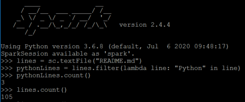
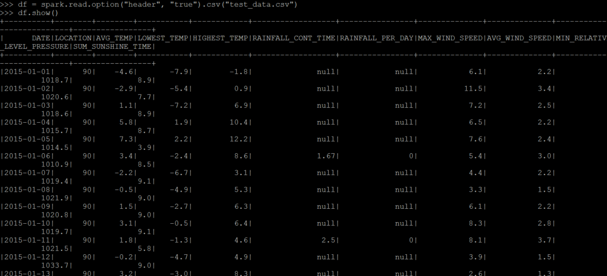
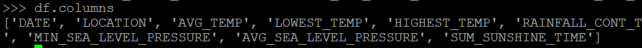
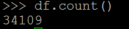
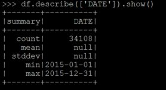

# SPARK Install & Cluster 구성 부터 df까지

## Spark Install

### java 설치

- spark에는 자바가 필요하므로 자바를 설치 한다.
- 자바가 이미 설치돼 있다면 생략한다.

```bash
$ sudo apt-get install default-jdk
```

##### JAVA 환경변수 지정

환경변수를 지정하기 위해, Path를 알아야 합니다.
JAVA관리를 위한 명령어를 통하면, 각 JAVA들의 path를 확인할 수 있습니다.
예를 들어, /usr/lib/jvm/java-8-openjdk-amd64 라는 Path를 확인하여, environment 에 아래와 같이 추가해줍니다.

$ sudo nano /etc/environment

> JAVA_HOME="/usr/lib/jvm/java-8-openjdk-amd64"

저장을 하고 나서, 아래 명령어로 적용을 해주면 됩니다.

$ source /etc/environment

PATH가 제대로 지정되었는지 확인하기 위해서는 아래 명령을 사용합니다.

$ echo $JAVA_HOME

### spark 다운로드 및  설치

- spark-2.4.4-bin-hadoop 2.7.tgz을 설치하도록 한다.

```bash
$ wget https://archive.apache.org/dist/spark/spark-2.4.4/spark-2.4.4-bin-hadoop2.7.tgz
$ sudo tar -xzvf spark-2.4.4-bin-hadoop 2.7.tgz
```


### spark란 폴더 이름으로 library에 저장

```bash
# spark란 폴더이름으로 현재 경로에 저장
$ mv spark-2.2.0-bin-hadoop2.7/ spark 

# spark란 폴더이름을 /usr/lib에 이동
$ sudo mv spark/ /usr/lib/
```


### 실행 Path 저장

- bashrc 실행

```
# open the bashrc 
$ sudo vim ~/.bashrc or $ vi ~/.bashrc
```

- JAVA_HOME구하기

  참고 :(https://all-record.tistory.com/181) (ubuntu 자바 설정)

```bash
#위치 확인
$ which javac
/usr/bin/javac

#javac의 실제 위치
$ readlink -f /usr/bin/javac
/usr/lib/jvm/java-11-openjdk-amd64/bin/javac
```

- PATH에 spark를 먼저 등록해주자(일회성)(알아두자)

```bash
$ export PATH=$PATH:/usr/lib/spark/bin
```

- 아래의 Path 정보를 bashrc에 입력

```bash
export JAVA_HOME=/usr/lib/jvm/java-11-openjdk-amd64
export SPARK_HOME=/usr/lib/spark
export PATH=$SPARK_HOME/bin:$PATH

#재부팅 안하고 bashrc 재시작
# cd /usr/lib/spark/bin에 들어가서 해주니 다했는데 안됐을때 됐다.
source ~/.bashrc
```

- default-java란 이름으로 java가 설치했으나  java-11-openjdk-amd64를 설치하였으므로 맨윗줄에 적었다.
- 이 외에 설치 했었다면 설치한 버전으로 바꿔줘야 한다.
- 설치된 spark의 Path정보도 입력후 $PATH에 append한다.

### spark 실행

-  **./spark-shell**을 실행해준다.

```bash
$ ./spark-shell
```

- 아래의 내용이 나오면 설치가 잘 된것이다.

```bash
$ spark-shell
Spark session available as 'spark'.
Welcome to
      ____              __
     / __/__  ___ _____/ /__
    _\ \/ _ \/ _ `/ __/  '_/
   /___/ .__/\_,_/_/ /_/\_\   version 2.4.4
      /_/

Using Scala version 2.11.12 (OpenJDK 64-Bit Server VM, Java 11.0.7)
Type in expressions to have them evaluated.
Type :help for more information.

scala> 
```

<hr/>

## Cluster 구성

### vitualbox 네트워크 어뎁터 설정

> master, worker 둘다 네트워크 => 어댑터1 => 어뎁터에 브리지
>
> 각각의 ip를 설정해줌

### master가 관리 할 worker등록

- master에 vim /etc/hosts에 worker1, worker2 등록해준다

```bash

192.168.202.36          localhost
192.168.202.36          master
192.168.202.42          worker1
192.168.202.43          worker2

# The following lines are desirable for IPv6 capable hosts
::1     ip6-localhost ip6-loopback
fe00::0 ip6-localnet
ff00::0 ip6-mcastprefix
ff02::1 ip6-allnodes
ff02::2 ip6-allrouters
```

### cluster ssh연결

- rsa 암호화방식으로 키 생성을 해준다

- sudo 로 실행 해야 하기 때문에 sudo로 생성해준다

```bash
$ sudo ssh-keygen -t rsa
#엔터 3번 

#키생성 확인 
#root 로 넘어가서
$ ls -al ~/.ssh/
-rw------- 1 root root 2602  7월  2 09:49 id_rsa
-rw-r--r-- 1 root root  567  7월  2 09:49 id_rsa.pub
```

  ```bash
$ chmod 700 ~/.ssh
$ chmod 600 ~/.ssh/id_rsa
$ chmod 644 ~/.ssh/id_rsa.pub
$ chmod 644 ~/.ssh/authorized_keys

#authorized_keys가 존재 하지 않을시 id_rsa.pub를 copy해준다
# $ cp id_rsa.pub ~/.ssh/authorized_keys
  ```

### Spark Cluster의 구축

- Master 인스턴스를 띄운다.
- Worker 인스턴스를 붙여 준다.
- 이를 반복해준다.

```bash
#master
SPARK_HOME/sbin/star-master.sh
$ cd /usr/lib/spark/sbin/
$ ./start-master.sh
```

- http://localhost:8080/을 접속하면 Master와 클러스터에 대한 구성 정보가 나온다.
- spark는 기본적으로 7077 포트를 사용한다.

### Worker의 인스턴스 환경 설정

```bash
#worker
SPARK_HOME/conf
$ cd /usr/lib/spark/conf
$ cp stark-env.sh.template spark-env.sh

#vim spark-env.sh
export SPARK_WORKER_INSTANCES=3
```

- export SPARK_WORKER_INSTANCES=3을 입력해주면 한번 명령어를 치면 worker 3명이 가서 일을 시작한다.

### Start Worker

```bash
#worker
SPARK_HOME/sbin/start-slave.sh
$ cd /usr/lib/spark/sbin
$ ./start-slave.sh spark://hostname:7077 -m 256M -c 2
ex) $ ./start-slave.sh spark://192.168.202.36:7077 -m 256M -c 2
```

- m : 사용할 메모리의 갯수
- -c : 사용할 코어의 갯수
- 잘 진행 되었다면 Workers 항목에 워커가 등록된다.
- 

### Test  Spark

- 실행이 됬다면 잘 동작하는지 확인해보자.
- vim 으로 test파일을 작성하자

```python
from pyspark import SparkContext

logFile = "/usr/lib/spark/README.md"
sc = SparkContext("local", "Simple App")
logData = sc.textFile(logFile).cache()

numAs = logData.filter(lambda s: 'a' in s).count()
numBs = logData.filter(lambda s: 'b' in s).count()

print("Lines with a: %i, lines with b: %i" % (numAs, numBs))

```

```bash
$ cd /usr/lib/spark/
./spark-submit test.py
```

<hr/>

## Error처리

### log4j:WARN Please initialize the log4j system properly 에러

log4j는 자바에서 사용하는 로그를 기록하는 라이브러리입니다.

이 라이브러리를 이용해서 많은 프로그램들이 디버깅용 로그를 남긴다든지, 시스템에 중요한 정보를 남긴다는지를 합니다.

log4j는 현재 동작하는 자바환경에서

**log4j.properties** 혹은 **log4j.xml** 파일을 찾아서 해당하는 파일의 정보값을 읽어서 

이렇게 설정된 대로 로그를 남기게 됩니다.

이 파일들이 CLASSPATH에서 찾을 수 없으니 이러한 워닝이 발생했다.

**[해결법]**

아래의 코드를 /usr/lib/spark/conf의 log4j.properties.template을 복사해서 log4j.properties을 하나 만들고 아래의 코드를 붙여 넣자.

```bash
# Set root logger level to DEBUG and its only appender to A1.
log4j.rootLogger=DEBUG, A1
# A1 is set to be a ConsoleAppender.
log4j.appender.A1=org.apache.log4j.ConsoleAppender
# A1 uses PatternLayout.

log4j.appender.A1.layout=org.apache.log4j.PatternLayout
```

### cannot run program "python": error=2, No such file or directory 에러

환경변수의 값이 잘못 설정 되어 있다.

**[해결법]**

```
export PYSPARK_PYTHON=python3
or 
vim ~/.bashrc에서
export PYSPARK_PYTHON=python3 추가
```

### ModuleNotFoundError - No Module named _ctypes 에러

설치해주자

```
# 우분투
sudo apt install libffi-dev 
```

<hr/>

## spark session 객체 생성

### sparkSession은 모든 Spark작업의 시작점이다.

```python
#파이썬에서 SparkSession 생성하기
from pyspark.sql import SparkSession
import time

spark = SparkSession.builder.master("local").appName("Word Count").config("spark.some.config.option", "some-value").getOrCreate()

time.sleep(60)
```

### worker를 연결후 예제 실행

```bash
./spark-submit testSession.py
```

<hr/>

## Spark에서 사용하는 Data Structure

- **RDD**
- **Dataset**
- **DataFrame**

### RDD

- Resilient Distributed Dataset = 분산된 데이터에 대한 자료 구조
- 병렬적으로 처리한다.
- 연산이 빠르다
- 불변하다
- 각 데이터 셋은 다른 노드에서 계산 될 수 있는 논리 파티션
- RDD는 사용자 정의 클래스를 포함 모든 유형의 python.java,scala 객체 포함
- 공식적으로는 읽기전용 파티션 레코드 모음
- MapReduce방식
  - 흩어져 있는 데이터를 수직화하여, 그 데이터를 각각의 종류 별로 모으고(MAP)
  - **Map** : 흩어져 있는 데이터를 Key, Value의 형태로 연관성 있는 데이터 분유로 묶는 작업
  - Filtering과 Sorting을 거쳐 데이터를 뽑아 내는(Reduce) 방식
  - **Reduce** : Map화한 작업 중 중복 데이터를 제거하고 원하는 데이터를 추출하는 작업
  


spark는 mapreduce를 빠르고 효율적으로 하기위해 사용한다.

- mapreduce는 복제,직렬화,디스크I/o때문에 데이터 공유가 느림
- HDFS (Hadoop Distributed File System) read/write에 90프로이상의 시간을 소비한다.

RDD 는 여러 분산 노드에 걸쳐서 저장되는 변경이 불가능한 데이터(객체)의 집합으로 각각의 RDD는 여러개의 파티션으로 분리가 된다. (서로 다른 노드에서 분리되어 실행되는). 

쉽게 말해서 스파크 내에 저장된 데이터를 RDD라고 하고, 변경이 불가능하다. 변경을 하려면 새로운 데이타 셋을 생성해야 한다.

RDD의 생성은 외부로 부터 데이타를 로딩하거나 또는 코드에서 생성된 데이타를 저장함으로써 생성할 수 있다.

RDD에서는 딱 두 가지 오퍼레이션만 지원한다.

- Transformation : 기존의 RDD 데이타를 변경하여 새로운 RDD 데이타를 생성해내는 것. 흔한 케이스는 filter와 같이 특정 데이타만 뽑아 내거나 map 함수 처럼, 데이타를 분산 배치 하는 것 등을 들 수 있다.
- Action : RDD 값을 기반으로 무엇인가를 계산해서(computation) 결과를 (셋이 아닌) 생성해 내는것으로 가장 쉬운 예로는 count()와 같은 operation들을 들 수 있다.

RDD의 데이터 로딩 방식은 Lazt로딩 컨셉을 사용한다. sc.textFile("파일")로 파일을 로딩하더라도 실제로 로딩이 되지 않는다. 파일이 로딩되서 메모리에 올라가는 시점은 action을 이용해서 개선할 당시만 올라간다.

### 예제

- pythonLines에 “Python”이라는 단어를 가지고 있는 라인만 추려서 새로운 RDD를 만들고, 그 다음 count() action을 이용하여, 그 줄 수 를 카운트 하는 예제이다.



- 실제로 README.md 파일을 읽는 시기는 sc.textFile로 오픈할 떄가 아니라 .count()라는 액션이 수행 될때이다.
- 이유는 파일을 오픈할때 부터 RDD를 메모리에 올려놓게 되면 데이터가 클 경우, 전체가 메모리에 올라가야한다. 이를 filter 등을 이용해 데이터를 정재후 action 을 수행하면 필요한 부분만 메모리에 적은 부분을 올릴 수 있다.
- action을 수행하면 로딩된 데이터는 지워진다.

### RDD 생성하기

RDD생성에는 두가지가 있다.

- 외부로부터 파일을 읽어서 로딩한다.

```python
lines = sc.textFile("README.md")
```
  - 드라이버 프로그램내에서 생성된 collection을 parallelize()라는 메소드를 이용해서 RDD화한다.
```python
seq_num = range(1,100)
spark_data = sc.parallelize(seq_num)
print(spark_data)
```

### DataFrame

- SparkSQL을 통해 사용할 수 있다.
- 불변하다.
- Named Column으로 구성되어있다.
- RDB Table처럼 Schema를 가지고 있으며 RDB의 Table 연산이 가능
- SQL등을 이용해 데이터를 join하고 추출가능하다.

### Dataset

- RDD와 DataFrame의 장점을 취한다.
- RDD와 매우 유사한 특징을 갖는다.
- DataFrame = Dataset[Row]
- 차이점이라면 Dataset은 type과 Schema가 정의되어 있다.

### RDD vs DataFrame vs Dataset 언제 사용하는가

- 데이터를 직접적으로 핸들해야하는 경우 -> RDD
- 추상화된 API를 사용한 간결한 코드 작성 및 성능 향상을 꾀하고자 한다면 DataFrame 및 Dataset

<hr/>

## csv파일 dataframe형태로 변환후 예제 실습

### CSV 파일 읽기(read)

```python
#CSV 파일 읽기
df = spark.read.option("header", "true").csv("test_data.csv")
df.printSchema()
df.show()
```



### df을 csv 파일로 저장하기(save)

```python
#df을 csv 파일로 저장하기
#coalesce(1)을 쓰는 이유는 분산된 상태로 저장하지 않기 위함
df.coalesce(1).write.format("com.databricks.spark.csv").save("/data/output.csv")
```

### 자주 쓰는 df을 캐시에 넣어두기(cache)

```python
#자주 쓰는 df을 cache에 넣어두어 실행속도를 빠르게 하는경우
df.cache()
```

### 모든 columns name을 반환(columns)

```python
#해당 df의 모든 columns name을 반환한다
df.columns
```



### df의 모든 row수를 반환(count)

```python
#해당 df의 모든 row수를 반환
df.count()
```



### 지정된 column의 정보를 표시(describe)

```python
#지정된 column의 정보를 표시해준다.
#여기서 정보는 count, mean, stddev, min, max가 포함되어있다.
df.describe(['DATE']).show()
```



```python
#해당 df의 모든 row를 반환한다.
df.collect()
#row를 5개만 가져온다
df.take(5)
```

### 지정된 df과 같은 df의 생성(alias)

```python
#지정된 df과 같은 df의 생성(alias)
df2 = df.alias("df")
```

